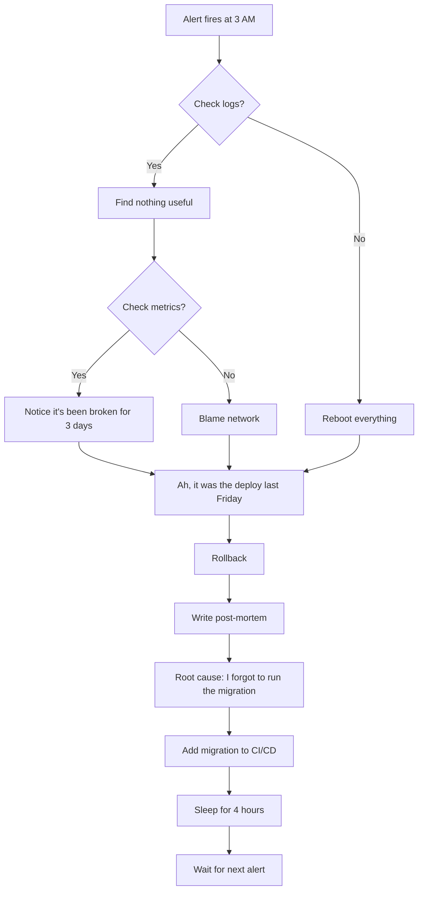

# Argenis Lopez | Backend Engineer & SRE Advocate

I design systems to survive production.

---

## Engineering Philosophy: Resilience by Design
I specialize in building Cloud-Native Backend Systems where reliability, observability, and infrastructure are first-class citizens. My work is focused on:

- **Chaos Engineering**: Automated weekly E2E failure simulations to verify system degradation and recovery.
- **Evidence-Based SRE**: A public record of **9 real production incidents** with detailed post-mortems and resolutions.
- **Clean Architecture**: Strict domain isolation to ensure logic remains independent of frameworks and infrastructure.

---

## Engineering Projects

### [Portfolio System: A Study in Resilience](https://github.com/Argenis1412/portfolio)
*Production-grade environment built to demonstrate SRE principles under pressure.*

- **Infrastructure as Code (IaC)**: Fully managed via Terraform with automated CI/CD provisioning.
- **Observability Stack**: Prometheus + Sentry + OpenTelemetry for full system transparency and honest telemetry.
- **JSON-First Read Path**: Reduced P95 latency from ~320ms to **<50ms** while eliminating DB as a single point of failure.
- **Multi-Layer Anti-Abuse**: Honeypots + Redis-backed Rate Limiting + Idempotency keys as architectural standards.

### [Loja App: Payment Logic Laboratory](https://github.com/Argenis1412/Loja_app)
*Payment engine focused on deterministic financial calculations and pure Domain-Driven Design (DDD).*

- **Deterministic Financials**: Logic guarantees mathematically exact totals by absorbing rounding drift in final installments.
- **Pure Domain**: 100% decoupling of business rules from infrastructure (SQLAlchemy/FastAPI).

---

## Tech Stack & Arsenal

  
  
  
  
  
  

---

## The Production Mantra

> "If it ain't broken, it's just a latent bug waiting for a Friday deploy. If it IS broken, it's probably DNS."

---

## Production Debugging Flowchart

## GitHub Analytics

 
 

---

## Contact & Links

  
  
  
  

